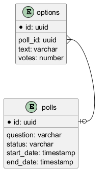

# Desafio Técnico Backend

## Resumo 

Essa é minha solução adaptada do desafio técnico compartilhado no [LinkedIn](https://www.linkedin.com/posts/d3vlopes_desafio-t%C3%A9cnico-backend-ugcPost-7386898997443178496-h03d?utm_source=social_share_send&utm_medium=android_app&rcm=ACoAACJ5cskBSGZnF8oggBgEcQjmUZi9B7Pzcr4&utm_campaign=share_via)

## Objetivo

Nesse desafio, você deve construir um sistema de enquetes em realtime, permitindo que os usuários criem enquetes com perguntas de múltipla escolha.

## Diagrama do DB

## Requisitos

- Deve ser possível criar uma enquete
- Deve ser possível editar uma enquete
- Deve ser possível excluir uma enquete
- Deve ser possível listar todas as enquetes
- Deve ser possível listar as enquetes por status
- Deve ser possível adicionar opções ilimitadas na enquete
- Deve ser atualizado o número de votos sem precisar atualizar a página (realtime)
- Deve conter teste de todos os controllers

## Stacks (adaptada)

- Python
- SQLAlchemy
- FastAPI
- Pydantic
- Pytest
- PostgreSQL
- Docker
- Swagger

## Regras de Negócio

- A enquete deve ter uma pergunta
- A enquete de ter uma data de início
- A enquete de ter uma data de término
- A enquete pode ter o status não iniciado/iniciado/em andamento/finalizado
- A enquete deve ter no mínimo 3 opções
- A enquete não pode ser editada depois de iniciar

